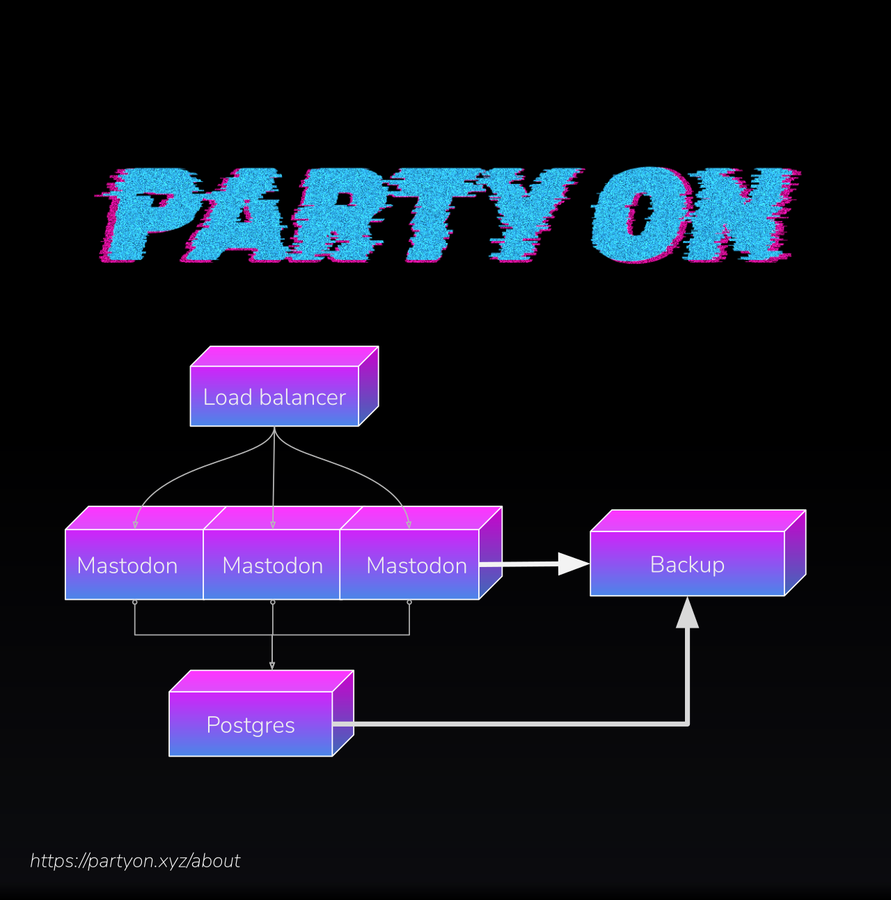

## PartyOn [](https://github.com/emersion/stability-badges#experimental)

 * [PartyOn](https://partyon.xyz/about)


## Usage

This repo contains LXD profiles which can be used to rapidly deploy Mastodon onto an LXD cluster.

Don't want to wrangle servers? See [Managed Mastodon](https://my.partyon.xyz/)


## Support

You can support the [PartyOn](https://partyon.xyz/about) instance by donation below.

 * [Patreon](https://www.patreon.com/nullagent)
 * [Liberpay](https://liberapay.com/dataparty)
 * [GitHub Sponsors](https://github.com/sponsors/sevenbitbyte)


## Container Profiles

 * load-balancer - HAProxy
 * mastodon-base - Mastodon + Redis
 * mastodon-postgresql - Postgresql




## Configure

The profiles are manually managed. You need to replace these values with correct settings for your environment.

  * `MASTODON_DOMAIN`
  * `DEVOPS_USER`
  * `DEVOPS_SSH_PUBLIC`
  * `MASTODON_BACKUP_SSH_PUBLIC`
  * `POSTGRES_LAN` - Subnet postgres allows clients from
  * `POSTGRES_ADMIN_PASSWORD`
  * `POSTGRES_MASTODON_PASSWORD`
  * `MASTODON_SERVER_IPS` - Nginx server config. Set mastodon server IPs
    * ```server srv1 <<host>>:<<port>> send-proxy check```


### Backup node configuration

  * `MASTODON_SERVER`
  * `POSTGRES_SERVER`

## LXD Hosts

 * Mastodon Node
   * `load-balancer`
   * `mastodon-base[n]`
   * `mastodon-postgresql`
   * `mastodon-elastic-search`
 * Backup Node
   * `mastodon-backup`

## Scripts

 * `run-backup.sh`
 * `maas-machine-deploy.sh`
 * `provision-storage.sh`
 * `update-lxc-host.sh`


